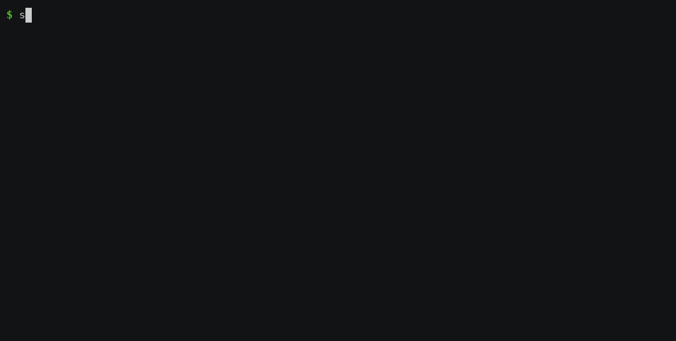
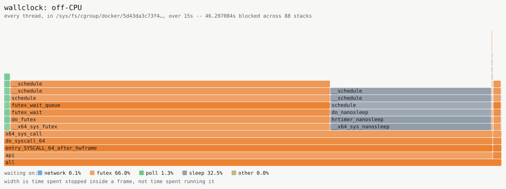

# wallclock

[](https://github.com/FranciscoPLoureiro/wallclock/actions/workflows/ci.yml)

A wall-clock latency profiler for Linux, in eBPF. It takes a PID, a cgroup or
a container and splits the time that passed into where it actually went: on
CPU, ready but waiting for a CPU, ready but stopped by its own cgroup quota,
blocked on the network per destination, blocked on a lock, blocked on disk.
The application is not recompiled, restarted or instrumented.



That is a real service — the API of
[the ticket office](https://github.com/FranciscoPLoureiro/HighConcurrencyTicketOffice),
taking about three thousand requests a second — profiled from outside the
container by its cgroup, with nothing added to the application and nothing
restarted. Fourteen seconds, uncut, including the ten it spends watching.

## The argument, in one table

The two lines that matter are *runqueue* and *throttled*, and they are the
reason the project exists rather than a nicety: they look identical from
outside and they are opposite problems. Two identical spinning processes on
an idle sixteen-core machine, one of them in a cgroup with `cpu.max` set to
20 ms in every 100 ms:

```
$ sudo wallclock profile -for 6s -comm wc- -top 4
     tid  observed        on-cpu     runqueue    throttled  blocked  unknown  command
  138977     5.95s    20.2% 1.2s  0.5% 28.6ms  79.3% 4.72s  0.0% 0s  0.0% 0s  wc-capped
  138979     5.98s  100.0% 5.98s   0.0% 152µs      0.0% 0s  0.0% 0s  0.0% 0s  wc-free

2 threads observed
every decomposition sums to 100% of the time observed
no threads lost
```

Both threads never stop asking for CPU. One gets 20.2% of one — the quota it
was given, measured, not assumed — and spends 79.3% of its life *ready and
forbidden*. The other gets 100%.

An off-CPU profiler reports the capped thread as roughly 80% "not running"
and offers no way to tell that from a machine with no CPUs to spare.
`runqueue 0.5%` is the sentence that distinguishes them: **nothing was
contended**. The fix is one line of a compose file, and a tool that reported a
single not-running number would have sent somebody to buy hardware.

**The percentages summing to 100% is the point.** `offcputime` gives off-CPU
stacks without separating *blocked* from *ready-but-starved*, `runqlat` gives
a distribution of runqueue latency without saying whose or why, and neither
knows anything about a cgroup's quota. A closed decomposition of one process's
wall clock in one window, with throttling separated from runqueue delay, is
the thing none of them produce.

## Drawn

One command, `make flamegraph`. An off-CPU flame graph rather than the usual
kind: the width of a frame is not how long that code ran, it is how long a
thread sat still inside it.



**Read the legend before the shape.** Every frame is coloured by what the
thread was waiting for, and each category is stated with its share, because a
picture embedded in a README is served as a flat image and has to answer the
question without being hovered over. On that API, over that window: futex 66%,
sleep 32.5%, poll 1.3% — and **network 0.1%**, on a Go service in the middle
of thousands of Redis, PostgreSQL and RabbitMQ round trips a second.

That last number is not a defect in the picture. It is
[what the Go runtime does to this measurement](docs/DECISIONS.md#the-go-execution-model-and-what-it-hides-from-the-kernel),
established with a controlled experiment rather than assumed, and it is the
reason time spent on each destination is measured a different way instead of
being split out of the blocked column.

## Compiled once, loaded by any kernel new enough

Thirteen kernels, one compiled object, no recompilation. Two matrices, both
reproducible with one command and neither needing root on the host: `make
matrix` boots kernel images under QEMU, `make distro-matrix` boots the cloud
images distributions publish. **Five of them run on every pull request**, so
this table is a check rather than something somebody did once.

| Kernel | Where | `task_struct` | Result |
|---|---|---|---|
| `4.19.322`, `5.4.296` | BPF CI images | no BTF | refused, correctly |
| `5.4.0-216-generic` | Ubuntu 20.04 | no BTF | refused, correctly |
| `5.10.259` … `7.1.1` | BPF CI images, six of them | 198 → 229 | pass |
| `5.15.0-190-generic` | Ubuntu 22.04 | 243 | pass |
| `6.1.0-52-cloud-amd64` | Debian 12 | 244 | pass |
| `5.14.0-687.el9_8` | Rocky 9 | 262 | pass |
| `6.17.0-*-azure` | GitHub Actions, per PR | 266 | pass |
| `7.1.9-arch1-2` | Arch, bare metal | 267 | pass |
| `6.8.0-138-generic` | Ubuntu 24.04 | 273 | pass |

`task_struct` is measured at eight different sizes between 198 and 273
members. The pairs are the argument, because they hold the version constant:

| Same upstream version, different build | `task_struct` |
|---|---|
| 5.15.210 against Ubuntu 22.04's `5.15.0-190` | 212 against 243 |
| 6.1.176 against Debian 12's `6.1.0-52` | 224 against 244 |

Thirty-one members apart on the same nominal kernel, one binary loading on
both. That is CO-RE stated as a measurement rather than as a principle.

**The matrix found a bug, which is the better half of the story.** On Red Hat
kernels the tool reported thread ids of 6911073 and 7102830 with an empty
command column — bytes of a `comm` read as an integer — under a decomposition
that closed to 100% and a report that said no threads were lost. Rocky 9 calls
itself 5.14 and carries the PREEMPT_RT patchset's lazy preemption, which adds a
field to the header every tracepoint record begins with and moves everything
after it. Both integrity claims this tool makes about its own output were
perfectly true of the wrong threads. The offsets are now read from the kernel
that is about to load the programs; the whole account is in
[docs/COMPATIBILITY.md](docs/COMPATIBILITY.md#what-the-matrix-found).

## Status

| Phase | Scope | State |
|---|---|---|
| 0 | Environment, repository, CI that loads BPF into a real kernel | ✅ done |
| 1 | First program end to end: map aggregation and a ring buffer path | ✅ done |
| 2 | Off-CPU, runqueue delay, and cgroup throttling separated | ✅ done |
| 3 | What the Go runtime makes invisible from the kernel's side | ✅ done |
| 4 | Network time attributed to individual destinations | ✅ done |
| 5 | Validation against injected latency, and measured overhead | ✅ done |
| 6 | Point it at a real service and answer a real question | ✅ done — [the answer](docs/DECISIONS.md#pointing-it-at-the-question-it-was-built-for) |

Phase 6 asked where the ticket office's p99 went when Prometheus and Grafana
started sharing its machine. Re-run on bare metal with three samples of every
cell, the answer is that the observability stack costs between 0.1% and 0.8%
of throughput and every one of those differences is smaller than 0.7 standard
deviations of the runs it is a difference between. Runqueue delay is 0.3%,
throttling is 0.0%, and the API is blocked 96.6% of the time waiting on its
dependencies. Neither of the two things this tool separates is happening, and
the closed account is what makes that a statement rather than a guess: there is
nowhere else for the time to be hiding.

Two limits on that, stated because they are the first things worth asking. The
workload is the purchase path rather than the sold-out refusal path the original
observation was taken under, so this is not a like-for-like reproduction. And
there is no positive control in the experiment: `validate` shows the tool
detects injected queueing and throttling synthetically, but nothing here shows
it would have detected them *on this service, on this machine*. A negative
result is worth what its instrument is known to be worth.

## Quick start

Needs a Linux host — see [compatibility](docs/COMPATIBILITY.md) — and root for
anything that touches the kernel.

```bash
sudo bash scripts/dev-env.sh     # the pinned toolchain: clang, llvm, libbpf headers, Go
make build
sudo ./bin/wallclock preflight   # does this host meet the requirements
sudo ./bin/wallclock profile -for 10s -comm myservice
```

| Command | Does |
|---|---|
| `make verify` | Everything CI runs: clang, `go vet`, the linter, the tests |
| `make smoke` | Every test that needs a real kernel (needs root) |
| `make matrix` | Load and test across kernels under QEMU (no root needed) |
| `make distro-matrix` | The same, against the kernels distributions ship |
| `make validate` | Measure the tool against answers known in advance |
| `make overhead` | Measure what the tool costs against event rate |
| `make compare` | Run wallclock, `offcputime` and `runqlat` on the same subjects |
| `make flamegraph` | Record off-CPU stacks and render the picture above |

`make verify` runs as an ordinary user and the tests that need a kernel skip.
`make smoke` sets `WALLCLOCK_REQUIRE_BPF=1`, which turns that skip into a
failure — the distinction is load bearing, and
[why](docs/DECISIONS.md#the-environment-checks-attempt-the-operation-instead-of-inspecting-for-it)
is one of the things this project keeps relearning.

The compiled BPF object is embedded in the binary by
[bpf2go](https://pkg.go.dev/github.com/cilium/ebpf/cmd/bpf2go), and both the
object and the Go bindings are committed, which is what makes `go build` work
on a clone with no clang in sight. CI regenerates them and fails if the Go
side has drifted from the C.

## What this does not measure

A limitations section written properly earns more trust than its absence, and
most of these were found by measuring rather than by guessing.

**A thread that never leaves its CPU is never seen.** This tool learns of a
thread from scheduler events. A thread that holds a core for the whole window
produces none, and does not appear at all — not as a zero, as an absence. The
same is true of a thread that was already asleep when profiling started and
never wakes.

**Go's network waiting is not here, and neither is anyone else's event loop.**
A goroutine parked in the netpoller stops no thread, so it costs no blocked
time. PostgreSQL backends and Redis wait in `epoll` for the same effect.
[Measured](docs/DECISIONS.md#the-go-execution-model-and-what-it-hides-from-the-kernel):
across a whole machine under load, six threads recorded any network-blocked
time at all, 164 ms between them, every one a short-lived one-shot client.

**`destinations` silently omits a connection it cannot pair.** It pairs a send
with the next receive on the same connection, which is what a request/response
protocol does; a connection that streams one way or pipelines several requests
before reading a reply is not measured — and is then *absent from the table*
rather than listed as unmeasured. In phase 6 that hid Redis completely across
eighteen runs of a service where every request goes through it. An absence
caused by not measuring looks exactly like an absence of traffic.

**Futex time is ambiguous and cannot be disambiguated from here.** An idle Go
M parked in `notesleep` and a goroutine stopped on a contended mutex are the
same `futex_wait` on an address the kernel cannot interpret.

**"Blocked 96%" is not latency.** A process's decomposition is in
thread-seconds. Sixteen mostly-idle threads report the same 96% whether the
service handled a million requests or none.

**Percentiles are bucket ceilings.** Four buckets to the octave, so a reported
p99 is at or below the true one by up to 25%. Means are exact; percentiles are
not interpolated, deliberately.

**16 384 threads between reads.** Beyond that the map is full and events are
dropped — [counted and reported](docs/DECISIONS.md#how-this-was-validated-and-what-it-costs),
never silently. Event *rate* is not the limit: a quarter of a million context
switches a second loses nothing.

**It costs something, and how much depends on what else the machine is
doing.** Five to nine per cent of throughput at around 75 000 context switches
a second, measured three times against noise floors between 0.8% and 4.7%.
Above roughly a hundred thousand the measurement method can no longer resolve
the profiler at all, which is stated rather than filled in with a number.

**Throttling needs a kernel built with `CONFIG_CFS_BANDWIDTH`.** Without it no
cgroup can be throttled and there is nothing to attach to; the column is
reported as unavailable rather than as a measured zero, and every other column
is measured as usual.

**Inside a pid namespace, `-pid` is refused rather than wrong.** The kernel
numbers pids in the initial namespace and a container numbers them
differently. `-cgroup` is the filter that means the same thing everywhere.

**x86-64 only, and arm64 does not currently build.** Two of the four programs
compile for it; the two using kprobes need arm64's `pt_regs` layout, which an
x86-64 host does not have. IPv4 only in `destinations`. Details in
[docs/COMPATIBILITY.md](docs/COMPATIBILITY.md#known-gaps).

## Requirements

Linux 5.8+, kernel BTF, cgroup v2 with the `cpu` controller, and `CAP_BPF` +
`CAP_PERFMON` — in practice root or a container granted both. Full detail,
including what each missing piece costs and every kernel this has been run on,
in [docs/COMPATIBILITY.md](docs/COMPATIBILITY.md).

## The rest

- **[docs/DECISIONS.md](docs/DECISIONS.md)** — why this is built the way it
  is, seventeen decisions with the measurement behind each: what the Go
  runtime hides, why the ring buffer and not the perf buffer, what the
  verifier actually refused, why not bcc or bpftrace, and how phase 6 was run
  twice.
- **[docs/COMPATIBILITY.md](docs/COMPATIBILITY.md)** — what a host needs, how
  each requirement is checked, and the full kernel matrix.
- **[docs/FINDINGS.md](docs/FINDINGS.md)** — the four defects that running this
  in new places uncovered, why nothing caught them, why the QEMU matrix never
  worked before, and how strongly each conclusion is supported — including the
  three that were stated confidently and then retracted.

## Licence

MIT. See [LICENSE](LICENSE).
