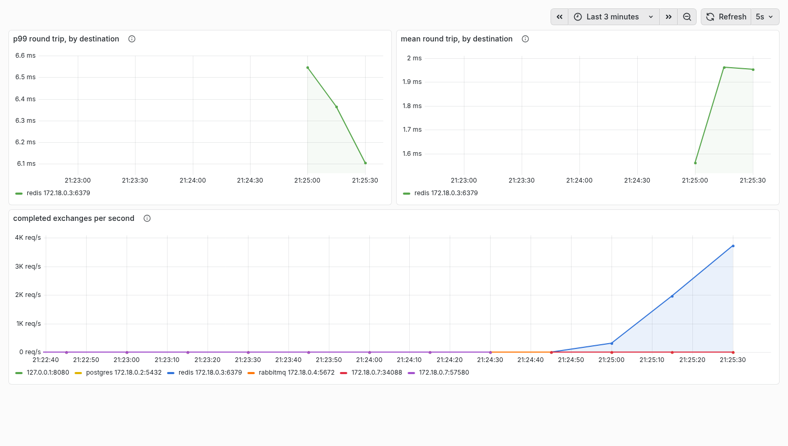

# Decisions

Why this is built the way it is, what was measured to decide it, and what was
found out by being wrong first.

These were the bulk of the README, which grew to 83 KB and stopped being read.
They are here because the argument on the front page should be settleable in
three lines and a table, and because a decision worth writing down is worth
being findable rather than scrolled past. Nothing has been deleted.

The README links into individual sections; each is self-contained.

The format is deliberate: context, the options actually considered, the
decision, and what it costs.

## A thread seen for the first time halfway through

**Context.** A profiler that starts while the machine is already running sees
threads in the middle of their lives. A thread first appears in a
`sched_switch` or a wakeup, and everything before that instant is unknown to
the tool — but not unknown in principle, since `/proc` has been keeping score
all along.

**Options.** Count the missing time as zero, seed each thread's state from
`/proc` at startup, or start each thread's accounting at first sight and say
so.

**Decision.** Start at first sight, and report the span each thread was
*observed* rather than the length of the session.

Counting the gap as zero is the tempting one and it is wrong in a way that
does not announce itself: percentages of the session window would come out
right for threads that were there from the start and quietly understate every
thread that arrived later, and nothing in the output would distinguish them.
Seeding from `/proc` is defensible and buys less than it looks: it can say a
thread was sleeping at t=0 but not what it had been doing, so it replaces an
honest gap with a state that is only half known.

The tail end is handled by the opposite rule. **Which event brings news of a
thread decides what may be done with it**, and this is the part that took four
attempts:

| Event | May create an entry | May revive an exited one |
|---|---|---|
| switch-out | yes | no |
| switch-in, wakeup | yes | no |
| `wakeup_new` | yes | yes |
| exit | plants a headstone | — |

A dying thread's last act is a context switch, moments after its exit event,
and a tid is handed to somebody new soon after that. Both arrive at the same
map entry and mean opposite things. `wakeup_new` is the only event that means
"this task did not exist until now", so it is the only one allowed to start
the books over.

**Consequences.** A thread that never schedules during the window does not
appear at all — a process blocked from before the session began and still
blocked at the end is invisible. That is the honest report of a tool that
watches the scheduler, and it is stated here rather than left to be
discovered.

## What happens when the maps fill up

**Context.** Every map has a `max_entries`. Threads, target sets, cgroups and
blocked reasons all grow with the machine, and a BPF map that fills does not
raise anything: the insert simply fails.

**Decision.** Every failure is counted, and every counter is printed in the
report, whether or not it fired.

A full map is the worst failure available to a measurement tool, because it
does not look like one. The numbers stay plausible, the percentages still add
to 100%, and the tool has silently stopped seeing part of the machine. The
counters are the difference between a report that is incomplete and a report
that is incomplete *and says so*:

```
LOST 50000 scheduler events: the threads map is at max_entries, so some
threads are missing from this report entirely rather than misfiled. That is
events, not threads -- one untracked thread contributes one per context switch
```

That message is the second version. The first said "LOST 50000 threads
entirely" on a machine with three hundred threads, because the counter counts
events and was labelled as though it counted threads. A number the reader can
see is impossible destroys the credibility of every line around it, which is
the opposite of what a drop counter is for.

**Consequences.** The bounds are 16384 threads, 16384 targets, 4096 cgroups,
8192 distinct stacks and 32768 thread-and-stack pairs. Exited threads are
drained on every read, and their blocked reasons with them, which is what
keeps a machine with heavy process churn from reaching those bounds at all —
a twelve second window on a build machine produced 660 entries where ninety
threads existed, before that draining was added.

## Throttling, measured twice

**Context.** Runqueue delay answers "this thread was ready and did not run"
and stops there. Two opposite situations produce it: the machine had no CPU
free, or the machine had CPU free and the thread's cgroup had spent its quota
for the period. Buy a bigger machine; raise a limit. No existing tool
separates them, which is the reason this project exists.

**Decision.** Hook `throttle_cfs_rq` and `unthrottle_cfs_rq`, keep a running
total of throttled time per cgroup, and have each thread record that total
when it joins the runqueue. When it finally runs, the difference is exactly
how much of its wait its own quota caused.

A running total rather than a list of intervals, because a total is enough
and is right in every case: an episode spanning the whole wait, one starting
in the middle, and any number beginning and ending inside it. "Was the cgroup
throttled when I looked" gets the last of those wrong.

kprobes rather than fentry. fentry is cheaper and both functions are static in
the kernel's BTF, which makes it the more fragile of the two — and throttling
fires a handful of times per 100 ms period against tens of thousands of
context switches a second, so the saving is unmeasurable.

**The validation is the point.** These numbers come from kprobes on the
scheduler; the kernel keeps its own tally in `cpu.stat`, by a route that
shares no code with them. A thread spinning in a cgroup capped at 20%:

| | |
|---|---|
| wallclock, for the thread | **1.607485793 s** throttled |
| `cpu.stat`, for the cgroup | **1.607395 s** (`throttled_usec 1607395`) |

Ninety-one microseconds apart in 1.6 seconds, and a ratio of 1.0001 over
three consecutive runs. A test asserts it on every run, because the value of
a second opinion is that it keeps being asked.

**If the kernel had no throttling hooks.** `throttle_cfs_rq` is static and
could stop being reachable; a kernel could be built without
`CONFIG_CFS_BANDWIDTH` at all. The fallback is `cpu.stat`, polled from
userspace: `nr_throttled` and `throttled_usec` are always there when the
controller is, and a poll every few milliseconds bounds the windows to the
poll interval. That is enough to say *whether* a cgroup was throttled during
a thread's wait and useless for saying *how much* of a two-millisecond wait it
covered — so the categories would survive and their precision would not. It
is a real answer and a worse one, which is why it is the fallback.

**Consequences.** A thread's cgroup is learned from
`bpf_get_current_cgroup_id`, which answers for the *running* task — so a
thread learns its own cgroup when it is scheduled out, not when it is woken,
where the running task is whoever did the waking. Until then its waits are
filed as ordinary runqueue delay. In practice that is one scheduling round,
and threads change cgroup about as often as they change process.

That id is also what `-cgroup` filters on, and it is the one filter that works
from anywhere: cgroup ids are global, and pids are not. Every namespace
problem in this project — a `-pid` that matches nothing, a `/proc` lookup that
names the wrong process, a test that cannot find its own subject — comes back
to that difference.

The cgroup map is bounded like every other, and when it fills, that cgroup's
throttling becomes invisible and its threads' waits go back to looking like
contention — the two categories this whole section exists to separate,
silently merged again. So it is counted and reported rather than absorbed.

## Why a thread stopped, and one number that does not add up

**Context.** "Blocked 22%" is half an answer. Waiting on a socket, waiting on
a mutex and waiting on a disk are one event to the scheduler and three
different problems to whoever has to fix one.

**Decision.** Capture the kernel stack with `bpf_get_stackid` at the moment
the thread stops, and classify it in userspace.

At that moment and no other: the thread is still on the CPU it is leaving and
the frames underneath it are the call that decided to stop. Only for a thread
that is actually stopping — a preempted thread's stack describes whatever it
was in the middle of, which is not a reason for anything.

Classification is in userspace because BPF cannot turn an address into a
symbol, and because the addresses are wanted whole in any case for the flame
graph. Stacks are scanned innermost first, past the `schedule` frames that sit
on top of every wait there is, until something meaningful appears:

```
$ sudo wallclock profile -for 5s -reasons
  149161  5.01s  0.0% 864µs  0.0% 530µs  0.0% 0s  100.0% 5.01s  wallclock
            futex    99.8% 5s
  142781  5.01s  0.0% 296µs  0.0% 699µs  0.0% 0s  100.0% 5.01s  kworker/15:3
            other    100.0% 5.01s
```

**epoll gets its own category** rather than being folded into network, and
that is phase 3 arriving early. A Go runtime parks goroutines in a netpoller
and the OS thread sits in `epoll_wait`; that thread is idle, not slow, and
calling it network would report a healthy server as spending its life waiting
on sockets.

**The bug this found, and how the wrong diagnosis nearly buried it.** For a
while the reasons for some threads added to *more* than the blocked time they
explain — up to 18% over, which cannot be true of the same intervals. It was
printed, labelled a known defect, and deliberately not clamped, because a
report that always adds up and is sometimes wrong is the failure this project
is arranged against.

The first explanation was that the two totals are read about a millisecond
apart. That was written down, and it was wrong — not because the mechanism was
wrong but because the bound was. **What lands in the gap between two reads is
not the length of the gap; it is the whole of whatever wait happened to close
during it.** A thread blocked for 900 ms whose wait ends in that millisecond
contributes 900 ms, twice: once as the open wait the totals measured, once as
the completed row the kernel filed a moment later.

Finding it took one measurement rather than more reasoning — print every row
for the worst thread — and the answer was immediate: one row was byte for byte
the open interval.

```
row 5.676ms      sleep   ..do_nanosleep
row 1.999982733s futex   ..futex_wait_queue
row 78.213µs     sleep   ..do_nanosleep     <- open=78.213µs, counted twice
```

The fix is an ordering: rows first, totals second, open waits added last. Read
that way the failure inverts and becomes honest — an interval that completes
between the two reads is in neither, so it goes unattributed and says so. A
test asserts on every run that no thread is ever over-attributed, because the
two calls look interchangeable and are not.

## The Go execution model, and what it hides from the kernel

**Context.** The kernel does not know what a goroutine is. It schedules
threads, and Go multiplexes thousands of goroutines onto a handful of them.
When a goroutine waits on a socket the runtime registers the descriptor with
an epoll instance, parks the goroutine, and the OS thread picks up another one
immediately. Nothing waits. There is no thread stopped on that socket for this
tool to find, because from the kernel's side nothing happened.

That is a claim about a negative, and a negative measured with one instrument
is worthless: *"wallclock reports no network waiting in this Go service"* and
*"wallclock cannot see network waiting"* produce identical output. So it is
measured against a control.

**The measurement.** The same binary does the same eight seconds of waiting
twice, against the same server, which holds every request for the same 40 ms.
Once through `net/http`, where the runtime owns the descriptor. Once through
raw blocking `read()` on a socket the runtime has never touched, on threads
pinned with `LockOSThread` so that the thread really is the thing that stops.
Three consecutive runs:

| who does the waiting | run 1 | run 2 | run 3 |
|---|---|---|---|
| goroutines, through the netpoller | **0s** | **1ms** | **0s** |
| OS threads, blocking on the socket | 8.263s | 8.227s | 8.220s |

The injected delay totals 8s, so the control is within 2.8% of ground truth
and the netpoller run is empty. The control is what makes the empty column a
fact about Go rather than a fact about this profiler, and it runs on every
`make smoke` and in CI, in `internal/offcpu/netpoll_test.go`.

Total blocked time is about the same in both windows — roughly 22 seconds
across roughly eighteen threads either way. Nothing waits less. What moves is
which column the waiting is filed under.

**There is no netpoller thread to label.** Phase 3 was specified as detecting
and labelling the netpoller threads. The first thing measuring it turned up is
that there are none. A Go service with sixteen concurrent clients, profiled
for ten seconds: all nineteen of its threads reported the same thing to within
a percentage point — about 90% of blocked time in futex, 5 to 7% in the
poller, under a millisecond on sockets. Not one of them was the netpoller;
every one of them was the netpoller sometimes. Go does not name its threads
either, so all nineteen carry the binary's name and nothing visible from the
kernel tells one M from another.

So the label moved from the thread to the process, which is where phase 3
decided honest scope lies anyway. A process is called a *rotating* event loop
when polling is a role passed around interchangeable threads rather than the
job of any one of them — and the criterion for that is not the obvious one.
The obvious one is the share of the polling the busiest thread holds. It is
wrong, because it measures the size of the machine:

| GOMAXPROCS | threads polling | busiest share | share done by dedicated threads |
|---|---|---|---|
| 16 | 16 of 18 | 22.4% | 0% |
| 4 | 6 of 8 | 35.3% | 0% |
| 2 | 3 of 5 | 50.5% | 0% |

Fewer processors mean fewer threads to rotate through, so each holds more of
an unchanged rotation, and at two a plainly rotating runtime crosses a
half-way threshold. What does not move is how dedicated a thread is: a thread
that *is* an event loop waits almost only in the loop, and a Go M waits 5 to
7% there and the rest parked in futex whether there are three of it or
nineteen. That is the last column, zero across the range, with the whole
threshold as margin.

The thread-level label still exists, because sometimes a thread really is the
poller — and then it is marked, so its blocked share is not read as a slow
dependency. Redis, in the same stack, under the same load:

```
  192104  25.27s  79.1% 19.99s  0.9% 227.6ms  5.8% 1.47s  14.1% 3.57s  0.0% 0s  redis-server [event loop]
            poll     13.6% 3.44s
            disk     0.5% 130.2ms
```

**The one category that still lies.** What a Go thread genuinely blocks on is
futex — channels, mutexes, GC assists and the scheduler parking idle Ms — plus
regular file I/O, which cannot be polled, plus cgo. Of those, futex is
ambiguous in a way the kernel cannot resolve: an M parked in `notesleep`
waiting to be given work and a goroutine stopped on a contended mutex are the
same `futex_wait` on an address the kernel has no way to interpret. The
experiment above is consistent with most of it being the first kind — roughly
eight seconds moved *out* of futex and into network when the same waiting was
done by threads instead of goroutines — but the tool cannot tell you which
kind you have, and says so rather than reporting an idle thread pool as lock
contention.

**Options.**

*A — honest scope at the level of the process.* Report per thread and per
process, document that Go's network waiting appears as threads in the poller,
and measure the categories that are real in that model: runqueue delay,
throttling, futex, disk.

*B — goroutine identity through a uprobe.* On amd64 with the register ABI from
Go 1.17, the `g` pointer is in R14, and a uprobe can read it and extract the
`goid`. The cautions are serious and none of them is hypothetical: `uretprobe`
on Go is dangerous because it works by rewriting the return address, and
goroutine stacks move when they grow; the offset of `goid` within `g` depends
on the Go version; and every part of it breaks silently on a runtime upgrade —
silently being the operative word, since a wrong offset yields a plausible
integer rather than an error.

*C — instrument the application to publish context.* The application writes a
request id into a shared BPF map. Correlation becomes perfect, at the cost of
no longer being a tool that works without instrumentation, which is the
premise of the project. **Refused on that ground alone.** It is not that it
would not work; it is that it answers a different question — if the
application can be changed, `net/http/pprof` and OpenTelemetry already exist,
are better at it, and do not need a kernel.

**Decision.** A, implemented. B is not implemented and the analysis above is
the deliverable: the value was in establishing *why* it is fragile, and it is
the first thing to cut.

**Consequences.** There are questions this tool cannot answer about a Go
process, and it now names them instead of answering them wrongly:

- *"How long did this service wait on the network?"* — not answerable from the
  kernel. The waiting is real and no thread does it.
- *"Which thread is the netpoller?"* — no such thread. The role rotates.
- *"It is 96% blocked, is that bad?"* — that is a statement about a thread
  pool, not about latency. Idle threads are blocked threads, and a process
  with sixteen mostly-idle threads reports the same 96% whether it served a
  million requests or none. The per-process view calls the column
  `thread-time` for this reason.
- *"Is that futex time lock contention?"* — unknown, and unknowable from here.

What it does answer, for Go and everything else: on-CPU time, runqueue delay,
cgroup throttling, disk, and how many threads a runtime is actually keeping
busy.

#### And what this decided about phase 4

Phase 4 was specified as attributing blocked network time to individual
destinations, with the scope note — written before any of this was measured —
that its target would be PostgreSQL and Redis, *"processes that really do
block threads on sockets"*, rather than the Go client. **That premise is
wrong, and the same window that proved the Go half disproves it.**

PostgreSQL backends do not block on sockets either. Waiting for the next query
from a pooled client, they sit in `epoll_wait`, and this tool marks every one
of them as an event loop:

```
  192528    25.25s  0.0% 5.2ms  0.0% 3ms    0.0% 0s  100.0% 25.24s  0.0% 0s  postgres [event loop]
            poll     99.5% 25.12s
            disk     0.5% 117ms
```

Redis is one thread in `aeMain`, which is the same picture. Across the *whole
machine* during a 25-second window with the stack under load — about eighty
thousand HTTP requests, each with at least one Redis round trip — six threads
in total recorded any network-blocked time at all:

| thread | network blocked |
|---|---|
| `dockerd` | 82.6 ms |
| `runc` (exited) | 44.6 ms |
| `runc` (exited) | 36.4 ms |
| `rabbitmq-diagno` (exited) | 401 µs |
| `k6` (exited) | 135 µs |
| `k6` (exited) | 110 µs |

Roughly 164 ms, all of it in short-lived one-shot clients — a container
runtime, a health check, threads of a load generator on their way out. **Not
one service.** Modern server software does not block threads on sockets; it
waits in an event loop, whether it is written in Go, C or Erlang.

So phase 4 as specified would have built a join with almost nothing to join.
The kprobes on `tcp_sendmsg` and `tcp_recvmsg` still fire — every socket
operation goes through them, blocking or not — and the TID-to-destination map
still fills. What is empty is the *blocked* time it was supposed to be
attributed to.

The decision, then, is that phase 4 is worth building and is not worth
building as written. It is reframed from *"split blocked network time by
destination"*, which is nearly always zero, to *"measure the time between a
send to a destination and the next receive from it, per thread"* — which
requires no thread to block, works for Go, PostgreSQL, Redis and the
synthetic case alike, and answers the question the phase was actually asked:
*waiting for whom?* The integration test with two servers at two known delays
still validates it, and the CO-RE reasoning about `skc_daddr` offsets is
unchanged. What changes is where the number comes from, and that phase 4 now
has to be validated against something other than blocked time, because blocked
time is not where the answer lives.

That reframing is not a rescue of a phase that failed. It is the phase before
it doing its job: phase 3 was placed ahead of phase 4 precisely so that a week
would not be spent building the wrong thing, and it was.

**And building it corrected the reframing twice more.** Both corrections came
from measurements rather than from thinking harder, and both are the same
lesson arriving in new places.

*Per thread was still wrong.* The sentence above says "per thread", because
the specification did, and it is not: a goroutine sends on whichever thread it
is running on, parks in the netpoller, and is resumed on whichever thread is
free. Keyed by thread, the answer finds no question — of twenty exchanges
against a known server, six paired. Keyed by the *connection*, all twenty do,
because a socket does not move between threads even when the goroutine using
it does. Phase 3's finding, arriving somewhere nobody was looking for it.

*A destination is somebody you call.* Pointed at the ticket office API the
first working version reported fifty-four destinations, of which fifty were
the load generator's ephemeral ports, each with more exchanges than PostgreSQL
and Redis had between them. The interval measured against a caller is real —
it is the time from answering one request to receiving the next — but that is
the *client's* think time, and it is not what the word promises. Connections
this process accepted are now marked at `inet_csk_accept` and left out, which
is why a destination table for that service has four rows and not fifty-four.

That last one carries a limit worth stating rather than burying: a connection
accepted *before* profiling starts is not marked, so a server that already has
clients still shows them. The way to get a clean answer is to attach first and
start the traffic afterwards, which is how the measurement above was taken —
on the second attempt.

## The histograms, in Grafana

`wallclock destinations -serve :9500` publishes one histogram per peer in the
Prometheus text exposition format, cumulative from the moment the session
opened — which is what `rate()` and `histogram_quantile()` need. The scrape
job is in [docs/prometheus-scrape.yml](prometheus-scrape.yml) and the
dashboard in [docs/grafana-dashboard.json](grafana-dashboard.json).



Three things in that picture are decisions rather than defaults.

**The latency panels have a traffic floor** — only destinations doing more
than one exchange a second. Without it a single idle keep-alive connection,
whose "round trip" is really a peer's think time, sits at two minutes and
flattens every real series to zero. That happened on the first render, and the
panel description says so rather than the filter being silent.

**The exporter is pointed at one cgroup.** Watching the whole machine puts
every ephemeral port on the box into the legend. `-cgroup` is not an
optimisation here; it is what makes the dashboard readable.

**Only Redis clears the floor in that window**, which is true rather than a
rendering accident: at this load it takes several thousand exchanges a second
and the other two take a few hundred in total. They are visible in the bottom
panel, which is deliberately unfiltered — a destination with a high latency and
two exchanges a second is a different problem from one with a low latency and
ten thousand.

One trap worth writing down, since it cost two renders: restarting a container
gives it a **new cgroup inode under the same container id**. An exporter
started before that restart then watches a cgroup nothing is in, and reports
nothing at all — very convincingly, with no error anywhere.

## Pointing it at the question it was built for

**Context.** The project this one grew out of left a sentence in its README: at
100 virtual users the p99 went from 153 ms to 291 ms once Prometheus and
Grafana were sharing the machine, and it could not say where the difference
went. That is a correlation. This section is what the tool says about it.

**Framing, because it decides how to read the rest.** The deliverable is the
tool and the method, not the verdict. A decomposition that closes to 100% is
worth having whichever category wins, and the answer below is not the one the
question implies.

**This is the second attempt, and the first one is why the protocol is now a
script.** The first was measured under WSL2 and reported something it could not
resolve: the gap between the two conditions was 17% of throughput under a light
profiling protocol and 2% under a heavy one, from one run of each cell. With
one sample per cell those two numbers cannot disagree, because neither has a
spread to disagree outside of -- and this project's own overhead section says
as much about this very target, that its documented p99 runs from 153 ms to
333 ms while the effect being looked for is a few per cent.

`scripts/phase6/run.sh` is that protocol written down. Reconstructing it found
four ways the experiment could measure the wrong thing, and three of them
produce a summary that looks entirely normal:

- The profiler ran unelevated, so the destination view was one line of error.
- The campaign is a hundred tickets, which is the right size for the oversell
  invariant it exists to test and the wrong size here: the stock is gone inside
  a second and the remaining three minutes measure the refusal path, which
  answers out of Redis and never reaches PostgreSQL or RabbitMQ at all.
- The per-IP rate limit defaults to a thousand a second and every virtual user
  shares the generator container's address. Ten million 429s, no purchases, and
  a summary that reads like a load test.
- **`compose stop prometheus grafana` followed by `compose up -d --wait` starts
  them again**, because `--wait` brings up every service in the file. Both
  conditions would have run with the full stack, the comparison would have been
  between a stack and itself, and "no difference" would have been perfectly
  reproducible and completely empty.

The last one is the one to worry about, because it produces exactly the null
result a reader accepts without checking. The script now counts the running
containers and refuses the cell if the independent variable is not what it is
supposed to be.

**Method.** Bare metal -- an Arch 7.1.9 host with twelve cores and no
hypervisor between the tool and the clock. The ticket office at 100 virtual
users, 200-second plateaus, stock raised so that every request exercises the
purchase path. Two conditions, three profiling protocols, **three runs of every
cell**, with the repeat as the outer loop so that the three samples of a cell
are separated by every other cell rather than taken back to back. Eighteen runs
in all.

**Why the throughput here is 460 a second and the recording at the top of the
README is three thousand.** They are different paths through the same service.
Once the hundred tickets are gone every request is refused out of Redis in
about two milliseconds, and a machine can do a great many of those; a request
that actually buys something writes to PostgreSQL and publishes to RabbitMQ,
and costs about two hundred. The demo shows the first because that is what a
campaign looks like a second after it opens. This experiment measures the
second, because the refusal path never reaches two of the three dependencies
and the destination view -- half of what is being compared -- would have been
empty of them. Neither number is wrong and they are not comparable, which is
worth saying out loud in a document that contains both.

**Throughput, and the spread that decides what it means.**

| Protocol | Condition | req/s | sd | latency |
|---|---|---|---|---|
| destinations only | without | 463.6 | 1.1 | 210.6 ms |
| | with | 460.3 | 5.1 | 212.1 ms |
| one 20 s profile | without | 462.2 | 2.3 | 211.2 ms |
| | with | 461.7 | 1.7 | 211.4 ms |
| seven 25 s profiles | without | 458.5 | 0.4 | 212.9 ms |
| | with | 454.9 | 5.3 | 214.6 ms |

The observability pair costs 0.71%, 0.12% and 0.78% of throughput under the
three protocols, and each of those differences is smaller than 0.7 standard
deviations of the runs it is a difference between. Across all eighteen runs the
full spread is 3.5%.

**The disagreement between protocols does not reproduce.** 17% against 2% under
WSL2; here the three protocols agree with each other, and what they agree on is
that there is no effect to measure. That does not prove the first measurement
was an artefact of the hypervisor. It establishes that on a host with no
hypervisor the effect is not there, and that the earlier disagreement had no
spread attached to it in the first place.

**The decomposition, summed over the twenty-one windows of each condition.**

| | without Prometheus & Grafana | with |
|---|---|---|
| thread-time | 2532.9s | 2530.6s |
| on-CPU | 3.09% | 3.18% |
| **runqueue** | **0.32%** | **0.41%** |
| **throttled** | **0.00%** | **0.00%** |
| blocked | 96.59% | 96.41% |

Neither of the two things this tool exists to separate is happening, and the
closed account is what makes that a statement rather than a guess: there is
nowhere else for the time to be hiding. The API is blocked 96.6% of the time,
waiting on its dependencies, and adding two containers to the machine does not
change that.

**Two limits on all of this, which are the first things to ask about a negative
result.**

*The workload is not like-for-like.* These runs raise the campaign stock so
that every request exercises the purchase path. The original observation was
almost certainly taken with the campaign sold out, which is the refusal path:
answered out of Redis in about two milliseconds, against about two hundred for
a purchase that writes to PostgreSQL and publishes to RabbitMQ. Different
bottleneck entirely. "The effect does not reproduce" is therefore a claim about
the purchase path, and the sold-out path has not been measured here.

*There is no positive control.* This is a negative result, and nothing in the
experiment shows the instrument would have produced a positive one. `wallclock
validate` establishes that queueing and throttling are detected when injected —
synthetically, with spinners and netem, on subjects built for it. It does not
establish that they would be detected *on this service, on this machine, under
this load*. The correct question from a reader is "your tool saw nothing, how
do I know it sees", and the honest answer today is that its sensitivity was
established elsewhere and assumed here.

Both are fixable with the harness that already exists: run the same protocol
with the api's quota tightened, and again with the machine oversubscribed, and
show the two columns light up. Then the negative row above means *under
conditions where this tool demonstrably detects queueing and throttling on this
service, neither is present when the observability stack runs* — which is a
different and much stronger sentence than the one it can support now.

**Where the time goes, and one destination that is not there.**

| destination | exchanges | mean | worst p99 |
|---|---|---|---|
| postgres | 385 110 / 391 038 | 8.71 ms / 8.58 ms | 114.7 ms / 98.3 ms |
| rabbitmq | 95 722 / 97 355 | 0.18 ms / 0.18 ms | 0.32 ms / 0.38 ms |
| **redis** | **0 / 0** | -- | -- |

PostgreSQL and RabbitMQ are unchanged, and slightly faster with the
observability stack running than without it, which is another way of saying the
difference is noise.

**Redis never appears at all**, in any of the eighteen runs, and every purchase
goes through it -- the stock script, the idempotency key and the rate limiter
are all Redis. This is a limitation of the measurement and not of the service.
`netlat` pairs a `tcp_sendmsg` with the next `tcp_recvmsg` on the same
connection, which is what a request/response protocol does, and the comment at
the top of `bpf/netlat.bpf.c` already says a connection that pipelines several
requests before reading any reply is measured as something else. What it does
not do is say so *in the report*: the connection is simply absent, and an
absence caused by not measuring looks exactly like an absence of traffic. A
reader of that table would conclude this service has two dependencies. It has
three.

That is the honest state of it. The decomposition answers the question that was
asked -- the observability stack is not taking CPU from the API, is not
queueing it behind a full machine, and is not throttling it -- and the
destination view, which would say where the time does go, has a hole in it that
the report does not admit to.

## How this was validated, and what it costs

**Context.** A measuring tool that has not been measured is an opinion. Every
other test here compares wallclock against arithmetic derived from what
wallclock observed, or against a second reading of the same kernel counters.
Neither answers the question a reader actually has, which is whether these
numbers mean anything at all.

**Ground truth.** So the answer is decided first — a thread will sleep for
exactly three seconds, forty-eight spinners will share sixteen cores, a cgroup
will be allowed exactly half a CPU, a socket will be delayed by exactly 50 ms
in each direction — and the tool is then asked what it saw. `wallclock
validate` runs all five and exits non-zero if any lands outside its band:

```
$ sudo wallclock validate
scenario           category           expected  reported  error  tolerance
sleep              blocked            3s        3.028s    +0.9%  2.97s to 3.25s   ok
runqueue delay     runqueue           2s        1.969s    -1.5%  1.8s to 2.16s    ok
cgroup throttling  throttled          1.5s      1.497s    -0.2%  1.38s to 1.575s  ok
futex contention   blocked (futex)    6s        6.065s    +1.1%  5.4s to 6.3s     ok
network delay      blocked (network)  2.6s      2.626s    +1.0%  2.522s to 2.99s  ok

how each expected value is known:
  sleep              30 sleeps of 100ms
  runqueue delay     48 spinners on 16 cores, so 1-16/48 of each life is queued
  cgroup throttling  cpu.max 50000 100000, so 50% of a spinner's life is forbidden
  futex contention   3 threads taking turns to hold one lock for 20ms each, over 3s
  network delay      netem 50ms on lo, charged both ways, over 25 round trips and a connect
```

**"Approximately 50 ms" is not an assertion; "between 48 and 55 ms" is.** Each
band is declared per scenario rather than as one global percentage, because
the error in each has a different shape *and a different sign*. A sleep can
return late and never early, and this tool can only miss time at the start, so
that band is tight below and loose above. The runqueue arithmetic assumes the
subjects are the only runnable work on the machine, which is never quite true,
and everything else running pushes the measured share up. Throttling gets the
tightest band because the kernel and the tool are measuring the same thing from
two sides — and that row is *also* checked against `cpu.stat` inside the
scenario, where a disagreement is returned as an error rather than absorbed by
a wide tolerance. It is not a matter of degree: two sources that share no code
either agree or one of them is broken.

Two facts had to be measured before the network row could be written, and both
would have made the table read like a defect if they had been assumed. netem
on the loopback device charges its delay in *both* directions, so a round trip
costs twice what was configured — `ping 127.0.0.1` under `netem delay 50ms`
reports an RTT of 100.6 ms. And a blocking `connect` pays a full round trip of
its own, measured at 100.5 ms against 101 ms for each subsequent exchange, so
the expectation is twenty-six round trips and not twenty-five.

That row also exists in the shape it does because of
[what phase 3 found](#the-go-execution-model-and-what-it-hides-from-the-kernel):
injected network latency can only be validated against something that stops a
*thread*, and almost nothing does. The subject is a raw blocking socket on a
pinned thread. The echo server it talks to is an ordinary Go listener, which
is the finding being used rather than worked around — a netpolled runtime
cannot pollute a network-blocked total because it is incapable of producing
one.

**The validation found a defect in the tool.** The network row first reported
2.524s against 2.6s and scraped the bottom of its band. The time was all
there; the *reason* for exactly one interval was not. A blocked thread's stack
is recorded on the transition into blocked, except on the transition that
creates the entry — so a thread that was already holding a CPU when profiling
started, and whose next move was to stop, lost the explanation for that wait.
Few threads, and an unbounded amount of time, since the wait they begin can
last the whole window. Fixed, and the row now reads 2.624s, +0.9%, with the
reasons closing exactly.

**Overhead, and the noise floor.** Not measured against the ticket office, and
the reason is arithmetic: that target's own documented variance is 153 ms to
333 ms at the p99, and the effect being looked for is a few per cent. The
signal would be an order of magnitude under the noise. So the load is
synthetic and tunable — two pinned threads passing a byte through a pipe, with
adjustable CPU work between round trips — and the answer is a curve.

Measured on the machine declared below, 2 s runs, median of five:

```
$ sudo wallclock overhead -for 2s -repeats 5
  pairs  work/trip  switches/s  baseline trips/s  profiled trips/s     overhead  noise  lost
      1       20ms          99                50                50  under noise   0.0%  none
      1        2ms         917               458               460  under noise   0.9%  none
      1      200µs        5378              2689              2746  under noise   2.1%  none
      1       20µs       13603              6802              6252        +8.1%   5.3%  none
      1         0s       20871             10436             10530  under noise   4.3%  none
      4         0s       73978             36989             34880        +5.7%   0.8%  none
     16         0s      209227            104614            102664  under noise   2.8%  none
     64         0s      212570            106285            106714  under noise   1.4%  none
```

**The noise column is the point.** Cost is a difference between two runs, and
two runs of anything on a real machine differ — cores change frequency, other
work wakes, the pipe buffer is warmer the second time. So every row also
measures two *identical unprofiled* runs against each other, which is what
this method reports when the true answer is known to be zero. Anything smaller
than that has not been measured, and prints as `under noise` rather than as a
number somebody would quote back.

**The number to quote is a range, and that is because it was measured more
than once.** The run printed above reads 5.7% at seventy-four thousand
switches a second against a 0.8% noise floor. Repeating it later on the same
machine gave **+8.2% against 4.7% noise** and **+8.6% against 1.7% noise**, at
77 400 and 80 500 switches a second:

| run | switches/s | overhead | noise floor |
|---|---|---|---|
| first | 73 978 | +5.7% | 0.8% |
| second | 77 414 | +8.2% | 4.7% |
| third | 80 506 | +8.6% | 1.7% |

So the honest figure is **five to nine per cent of throughput at around
seventy-five thousand context switches a second**, and quoting the 5.7% alone
would be quoting the best run as though it were the typical one. The two later
runs had a container runtime idling on the machine and the first did not,
which is not a controlled difference — it is the ordinary condition of a
laptop, and it moves the answer by half again.

The third run is the one worth reading, because 8.6% against a 1.7% floor is a
clean measurement by this method's own standard, and it disagrees with the
published number. The second is what a noisy machine looks like: 8.2% against
4.7% is barely a measurement at all, and the noise column is there so that it
cannot be mistaken for one.

Above roughly a hundred thousand switches a second the load saturates sixteen
cores by itself and the method can no longer resolve the profiler at all,
which is worth saying plainly rather than filling the row with a figure. That
part reproduced in all three runs.

**The limit that is actually reachable is not the event rate.** A quarter of a
million switches a second loses nothing, because the same few threads are
switching and the map holding them stays the same size. What fills it is *new*
threads: a slot is released only when userspace reads the map and drains the
ones that exited, so the number that matters is threads between reads.

```
  processes  per second  threads held  events dropped  stacks lost
       2000        5176          2076               0            0
       8000        4069          8103               0            0
      20000        4354         16384           18417            0
```

16 384 is `max_entries` exactly. Past it the tool drops events, counts them,
and says so on every report — a tool that loses five per cent of its events in
silence lies with confidence. The streaming path has the same property and a
far lower ceiling, measured in phase 1: 13 455 aggregated entries with no loss
at all against 1 591 513 events delivered and 28 653 339 dropped over the same
window, which is why aggregation happens in the kernel and the ring buffer is
reserved for detail that cannot be reduced.

**Environment.** WSL2 Debian 13, kernel 6.6.87.2-microsoft-standard-WSL2, 16
CPUs, 7.6 GB, ext4. Every number above comes from that host and is reproducible
with `make validate` and `make overhead`.

## Blocked time and runqueue delay are different numbers

**Context.** A thread that is not running is doing one of two things: waiting
for something to happen, or waiting for a CPU after it already happened.
`offcputime` reports both as one quantity, because from off the CPU they look
identical.

**Decision.** Measure them separately, from three scheduler tracepoints:

```
blocked         sched_switch(leaving, not runnable)  ..  sched_wakeup
runqueue delay  sched_wakeup                         ..  sched_switch(arriving)
```

A thread leaving the CPU **while still runnable** was preempted and goes
straight back to the runqueue, so there is no wakeup to wait for and the
runqueue clock starts at the switch. The tracepoint reports that case as
`TASK_RUNNING`, or as `TASK_REPORT_MAX` when the switch was a preemption —
and missing the second is the most expensive mistake available here.
Preemption is the *common* case on a busy machine, so filing it as blocked
would move the bulk of runqueue delay into the blocked column and invert
every conclusion the tool exists to reach.

The two have opposite remedies. Blocked time says make the thing being waited
on faster. Runqueue delay says the machine does not have enough CPU — or, once
phase 2 finishes, that the cgroup was not allowed to use what there was, which
is a third answer again and the one no existing tool separates.

**Consequences.** The decomposition is per thread and it closes: on-CPU,
runqueue, blocked and unknown sum to the time each thread was observed, and
the tool prints whether they did rather than asserting it. Two things that are
deliberately visible in that sentence:

- **Observed, not the session window.** A thread first seen halfway through
  has half a window nobody watched. Reporting percentages of the session would
  silently attribute time that was never measured, so each thread reports the
  span it was actually watched for.
- **The residual is printed, and it found a real bug.** Across the whole
  machine it now reads `every decomposition sums to 100% of the time
  observed` — exactly zero, five runs out of five. It did not start that way.
  The first machine-wide run reported a decomposition off by 16 ms, then 60,
  then 132, while every synthetic thread closed perfectly.

  The cause was **thread 0**. Every CPU has its own idle task and all of them
  report pid 0, so one map entry was being written by sixteen cores at once;
  the accumulators are plain additions, correct for a thread that runs on one
  CPU at a time and not for sixteen concurrent writers. Skipping the idle task
  loses nothing — idle time belongs to a CPU, not to a thread — and the
  residual went to zero.

  A tool without that check would have printed the same plausible table and
  been quietly wrong. The residual is not decoration; it is the only thing
  that would have noticed. It is still printed when it is small, with a
  declared 1 ms tolerance for the cost of reading a map the kernel is writing
  to, and anything past that is called what it is.

## Aggregate in the kernel, stream only when you must

**Context.** A BPF program can keep a running total in a map that userspace
reads when it wants a number, or it can send every event up a ring buffer and
let userspace do the work. Phase 2 attaches to `sched_switch`, which fires
tens of thousands of times a second on a busy machine, so this choice stops
being stylistic.

**Options.** Both, implemented, and measured rather than argued about.

**Decision.** Aggregate in the kernel. Stream only where individual events
carry something a counter cannot hold.

The measurement is more lopsided than the reasoning predicted. Same machine,
same 10 second window, same tracepoint, nothing else changed:

| | delivered | lost |
|---|---|---|
| counting in a map | 13 455 entries, 72 processes | 0 |
| streaming every event | 1 591 513 events | **28 653 339** |

*WSL2, Debian 13, kernel 6.6.87.2-microsoft-standard-WSL2, 16 CPUs, 7.6 GB.*

The ring buffer delivered five per cent of what it was given. But the more
interesting number is the total: thirty million events in ten seconds on a
machine that, counted in the kernel, made thirteen thousand syscalls in the
same window. The observer produced the difference. Draining a ring buffer
costs syscalls, those syscalls hit the same tracepoint, and each one produces
another event to drain.

Filtering the stream to a process that is not the observer settles it:

```
$ sudo wallclock syscount -for 10s -stream -pid 539
2506 events
no events lost
```

Two and a half thousand events, nothing lost, from the same buffer that was
discarding ninety-five per cent a moment earlier. The flood was self-inflicted.

**Consequences.** The categories in phase 2 are counters and histograms, and
they live in kernel maps. Streaming survives for the cases where a single
event carries irreducible detail — a stack id, a destination address — and
those are sampled or filtered hard at the source rather than fanned out.

It also sets the standard for what "measured" means here. A tool that had not
counted its drops would have reported 1 591 513 events with total confidence
and been wrong by a factor of twenty, and nothing in the output would have
hinted at it. That is the failure this project exists to not have, and it took
until the first program to meet it.

## Ring buffer, not perf buffer

**Context.** Getting bytes from a BPF program to userspace has two mechanisms.
`BPF_MAP_TYPE_PERF_EVENT_ARRAY` is the older one, per-CPU; `BPF_MAP_TYPE_RINGBUF`
arrived in 5.8 and is shared across CPUs.

**Decision.** The ring buffer, which is also why the kernel floor for this
project is 5.8.

Three properties decide it. It is one buffer rather than one per CPU, so
memory is not multiplied by core count — on the 16-CPU machine above, a perf
buffer sized the same per CPU would reserve sixteen times the memory to hold
the same events. Events keep their order across CPUs, and phase 2 exists to
correlate a `sched_wakeup` on one CPU with the `sched_switch` that follows it
on another, which an unordered per-CPU transport makes into guesswork.
And `bpf_ringbuf_reserve` hands back the final memory *before* the event is
written, so a full buffer is discovered before anything is copied instead of
after — which is the difference between the drop counter above costing a
branch and costing a wasted copy.

**When the perf buffer still wins.** When the consumer is per-CPU too and
ordering is irrelevant — a sampling profiler pinning a reader to each core
avoids all cross-CPU contention on a single shared buffer. And on kernels
before 5.8, where it is the only thing there is.

## What the verifier actually refused

**Context.** The verifier, not the compiler, is what rejects BPF programs, and
it is the thing that will cost the most time on this project. Describing it
abstractly is easy and worth little.

**Decision.** Keep the rejections as fixtures with tests that assert them, so
the record cannot age into fiction.

The first one here was a map lookup dereferenced without a null check —
ordinary C, and unacceptable kernel code:

```c
__u64 *count = bpf_map_lookup_elem(&counts, &tgid);
*count += 1;                     /* no check */
```

```
load program: permission denied:
    R0 invalid mem access 'map_value_or_null'
    processed 8 insns (limit 1000000)
```

`map_value_or_null` is the verifier's name for what the helper returns: either
a pointer into the map or NULL, and the program may not touch it until the
branch that separates those has been taken. The fix is two lines. The errno is
a red herring — `EACCES` is what every rejected load returns, whatever the
reason, which is why the log matters and the error code does not. The fixture
lives in [`internal/bpfload/testdata`](../internal/bpfload/testdata/unchecked_lookup.bpf.c)
and a test asserts the kernel still refuses it.

Two more the verifier insisted on, both in
[`bpf/syscount.bpf.c`](../bpf/syscount.bpf.c):

- **Every lookup, even one that cannot fail.** An array map indexed by a
  constant the verifier can prove is in range still returns a maybe-null
  pointer, and it will not take the program's word that this call site is
  different.
- **Every filter is a constant, not a parameter.** The filters are
  `const volatile` globals patched into `.rodata` before the load: `const` so
  the verifier folds an unused filter's branch away entirely, `volatile` so
  clang does not decide the initialiser was the final answer and delete the
  read.

The limits worth knowing before phase 2 — a 512-byte stack, loops that must be
bounded or use `bpf_loop`, and an instruction ceiling of a million — have not
been hit yet. The programs here are tens of instructions. That will change.

## Pids from the kernel are not the pids in your /proc

**Context.** `bpf_get_current_pid_tgid` returns the pid as the **initial**
namespace numbers it, always, regardless of where the program reading it sits.
Development here happens inside a WSL distribution, which is a pid namespace
like any container.

**Decision.** Carry the process name from the kernel in the map value, and say
so plainly when the numbers will not match the reader's `/proc`.

This surfaced as every row of the first working output showing `(exited)`: the
tool was resolving names by reading `/proc/<pid>/comm` for pids that number
processes in a namespace it cannot see. The pids were fine. The lookup was
meaningless — and, worse than meaningless, since the two ranges overlap, a
lookup that hit would have named an unrelated process with total confidence.

The same trap sits under the `-pid` filter, where it is quieter: a pid copied
from `ps` inside a container matches nothing in the kernel, and the tool
reports a busy process as idle. So the tool checks whether it is in the
initial pid namespace — the kernel gives that one a fixed inode,
`PROC_PID_INIT_INO` — and says so when it is not.

**Consequences.** Carrying a 16-byte name in the map value costs one copy per
process rather than per event, since it is only written by the insert that
first sees a process. The name is therefore the one it had when first seen; a
process that `exec`s later keeps the old one, which is the right trade for a
counter and would be the wrong one for an audit log.

## CO-RE, not BCC

**Context.** A BPF program that reads a field out of a kernel struct — and
this one will read many, starting with `task_struct` — has to know that
field's byte offset. Offsets move between kernel versions and between build
configurations: a field added in the middle, a config option that includes or
excludes a member, and everything after it shifts. A program compiled against
one kernel's headers is wrong on another, and wrong in the worst way, since it
reads a valid address containing a different field.

**Options.** BCC compiles the program on the target machine at run time,
against that machine's headers, which makes the offsets right by construction.
CO-RE — Compile Once, Run Everywhere — compiles ahead of time and emits
*relocations*: the object records "this access is to the field named `pid`
inside `task_struct`" instead of "load 8 bytes at offset 2464". At load time
the loader reads the target kernel's BTF, resolves each relocation against the
type information the running kernel describes itself with, and patches the
offsets before handing the program to the verifier.

**Decision.** CO-RE, with `cilium/ebpf` as the loader.

BCC's model costs a full clang and LLVM on every target machine — hundreds of
megabytes — plus the kernel headers, plus compilation on every start, which is
seconds of CPU and a page cache full of headers on a machine that is being
profiled *because* it is short of CPU. It also moves compilation failures to
run time on someone else's host, which is the worst place to find them.

The measurement that makes this concrete is already in this repository. The
same binary runs against `6.6.87.2-microsoft-standard-WSL2` locally and
`6.17.0-1022-azure` in CI, and those two kernels report `task_struct` with 240
and 266 members respectively. Nothing was recompiled between them.

**Consequences.** CO-RE requires BTF on the target — `CONFIG_DEBUG_INFO_BTF=y`
and `/sys/kernel/btf/vmlinux` — which is why that is a hard requirement rather
than a nicety, and why the preflight check parses the BTF and looks for
`task_struct` instead of stat-ing the file. On a kernel built without it, the
fallback is BTFHub-style external BTF blobs, which is a real answer and one
this project does not implement. Field accesses must also go through the CO-RE
macros rather than plain C dereferences; a plain one compiles, loads, and
reads the wrong bytes, which is the failure mode this decision exists to
prevent and the reason it is written down before the first such access is
written.

#### The case that makes it concrete: reading a socket's far end

Phase 4 needs two fields of `struct sock` — the peer's address and port — and
they are the sharpest example of why the offsets cannot be compiled in. This
is the entire declaration:

```c
struct sock_common {
	__be32 skc_daddr;
	__be16 skc_dport;
} __attribute__((preserve_access_index));

struct sock {
	struct sock_common __sk_common;
} __attribute__((preserve_access_index));
```

In the real kernel neither field sits where that says it does. `struct sock`
has over a hundred members and `sock_common` around forty, and both of these
live inside *anonymous unions*, beside aliases that let the kernel compare an
address and a port in a single 64-bit load:

```c
union {
	__addrpair skc_addrpair;
	struct { __be32 skc_daddr; __be32 skc_rcv_saddr; };
};
```

Their byte offsets move with the kernel version and with build configuration —
`CONFIG_NET_NS`, `CONFIG_XFRM` and others each add or remove members ahead of
them. Nothing warns when that happens. A program compiled against the wrong
offset does not crash; it reads whatever is there and reports a plausible IPv4
address belonging to nobody, in a table full of addresses.

What the relocation does is replace the question. `preserve_access_index` makes
clang record *"the field named `skc_daddr` inside `struct sock_common`"* rather
than a number, and at load time libbpf looks that name up in the BTF the
running kernel publishes about itself and patches in whatever offset that
kernel actually uses. The binary works on a kernel it has never seen because it
was never told an offset in the first place.

Two consequences worth stating. The fields left out of the declaration cannot
be got wrong, since matching is by name and nothing else is looked up — which
is why declaring two members of a struct with a hundred is not a shortcut. And
the anonymous unions do not need declaring at all, because BTF flattens
anonymous members into their parent, so `skc_daddr` is found as a member of
`sock_common` exactly as written.

The failure mode this replaces is not theoretical for this project: phase 2
lost a day to a *tracepoint* whose field offsets shifted between 6.6 and 6.17,
and the kernel refused the attach with `EACCES`, which reads as a permissions
problem. That one at least failed loudly. A struct read at a stale offset would
not have.

## Why not just use bcc-tools or bpftrace

**Context.** `offcputime`, `runqlat`, `runqslower`, `wakeuptime`, `tcpconnlat`
have existed for years and each does part of this. Not having an answer to
this ends the conversation.

**Decision.** They are not composable into what this produces. `offcputime`
aggregates off-CPU stacks but does not separate *blocked on something* from
*ready and starved of CPU*, and knows nothing about cgroup quota. `runqlat`
gives a histogram of runqueue latency without saying whose, or why, or whether
the delay was the machine being full or the cgroup being throttled — which are
opposite problems with opposite fixes, a bigger machine against a bigger
limit. Running both does not fix it either: the windows do not coincide, the
categories overlap, and neither closes to 100%.

**Evidence, because the claim is worthless without it.** `scripts/compare-tools.sh`
puts two subjects on the machine and runs all three tools against them:
`wc-capped`, a process spinning inside a cgroup allowed 20% of one CPU, and
`wc-napper`, a process that falls asleep inside the window and is still asleep
when it ends. Neither subject is chosen to flatter wallclock — the first is
never blocked on anything at all, and the second is the case every off-CPU
profiler was written for.

```
$ sudo WINDOW=12 sh scripts/compare-tools.sh

=============================== wallclock ===============================
   tid  observed    on-cpu   runqueue  throttled       blocked  unknown  command
  4553     11.5s  0.0% 2ms  0.0% 81µs    0.0% 0s  100.0% 11.5s  0.0% 0s  wc-napper
            sleep    100.0% 11.5s
  4537  12.26s  20.1% 2.46s  0.4% 46.9ms  79.6% 9.75s  0.0% 0s  0.0% 0s  wc-capped

=============================== offcputime ==============================
wc-capped: 91 separate stacks, 9521774us off-CPU in total
wc-napper: 0 stacks

the largest single stack it reports for wc-capped:
    schedule
    exit_to_user_mode_prepare
    irqentry_exit_to_user_mode
    irqentry_exit
    sysvec_hyperv_stimer0
    asm_sysvec_hyperv_stimer0
    -                wc-capped (4537)
        399644

================================ runqlat ===============================
     usecs               : count     distribution
        16 -> 31         : 107      |***********************************     |
        32 -> 63         : 116      |**************************************  |
        64 -> 127        : 5        |*                                       |
       ... (empty)
     65536 -> 131071     : 119      |****************************************|
```

**`offcputime` has the right number and the wrong story.** It charges
`wc-capped` 9.52 s of off-CPU time, which agrees with wallclock's 9.75 s of
throttling to within 3% — the two are looking at the same interval. But it
splits that across **91 separate stacks**, every one of them bottoming out in
`sysvec_hyperv_stimer0`: a timer interrupt. Read literally, it says this
thread kept being preempted by the clock. The quota that actually stopped it
is not in the output, because a stack cannot contain it — the reason a
throttled thread is off a CPU is not on its stack, it is in a cgroup's
accounting.

**`offcputime` cannot see the sleeper at all.** Zero stacks for the thread
that spent 11.5 of 12 seconds asleep. That is not a bug: it records an
interval when the thread comes *back* on the CPU, and this one never did. So
the longest wait in the window — the kind most worth finding — is the one it
structurally cannot report. wallclock carries open waits deliberately, which
is what `AttributeOpenWaits` is for, and it is why the sleeper is the first
row of its table.

**`runqlat` reports a healthy machine as a burning one.** The histogram is
bimodal: a cluster at 16–63 µs, which is genuine runqueue latency, and **119
samples between 65 ms and 131 ms**. On an idle sixteen-core host. Anybody
shown that histogram concludes the machine is catastrophically oversubscribed;
the truth is one cgroup with a 20% quota, and there is nothing in the output
to tell those apart. It also never says *whose* latency any of it was.

**And they cannot even be started together.** The script runs them one at a
time because it has to: two bcc tools launched at once both read
`/sys/kernel/kheaders.tar.xz` to compile against, and on this kernel that file
does not take two readers — the loser dies with `Unable to find kernel
headers` half way through the archive. Either works alone. That is a small
thing and it is the composability argument in miniature: three tools, three
windows, three vocabularies, and no way to add them up.

**Consequences.** wallclock's decomposition is not a prettier `offcputime`. It
answers a question neither of these can be made to answer — *which* of the
four things a thread can be doing it was doing, in one closed account — and
the two rows above are what that difference looks like on the same two
processes.

## Where this is developed, and why not on Windows

**Context.** The host is Windows 11. eBPF needs a Linux kernel with BTF, a
cgroup v2 hierarchy with the `cpu` controller, and root. The previous project
worked around Windows Smart App Control blocking the Go toolchain by running
Go in a container; that constraint had to be re-established here rather than
inherited.

**Options.** WSL2, a full Linux VM (Hyper-V, Multipass, VirtualBox), a small
cloud VM, or the Docker Desktop VM.

**Decision.** WSL2 with Debian 13, verified rather than assumed. Everything
the project needs was measured before a line was written:

| | |
|---|---|
| kernel | `6.6.87.2-microsoft-standard-WSL2` — above the 5.8 floor |
| BTF | `/sys/kernel/btf/vmlinux`, 6 050 732 bytes, parses |
| `CONFIG_CFS_BANDWIDTH` | `=y` — cgroup throttling is observable, which phase 2 depends on |
| cgroup v2 | `cgroup2fs`, controllers `cpuset cpu io memory hugetlb pids rdma` |
| scheduler tracepoints | `sched_switch`, `sched_wakeup`, `sched_wakeup_new` present |
| `throttle_cfs_rq` / `unthrottle_cfs_rq` | both in `/proc/kallsyms` |
| `sch_netem.ko` | present, so phase 5 can inject known delay |
| loading a program | proven, with a two-instruction program through the raw `bpf()` syscall |

The Docker Desktop VM was rejected because it runs the *same* kernel,
`6.6.87.2`, so it offers nothing WSL2 does not, in an environment nobody
controls. A separate VM was not needed: everything the project requires is
already present, and the Smart App Control problem does not follow the
toolchain into Linux — gcc, clang and the Go toolchain all run unimpeded
inside the distribution.

**Consequences.** The working tree lives on the WSL2 ext4 filesystem rather
than under the Windows user profile, which is not a preference. The same
small-file workload a Go or clang build produces — 300 files written and read
back — takes **57 ms** on ext4 and **4 002 ms** across the `/mnt/c` 9p mount,
a factor of seventy, before counting a cloud sync client that would otherwise
be replicating build artefacts and `.git` as they change. The tree stays
reachable from Windows through `\\wsl.localhost\`, so it is one working copy
seen from two sides rather than two copies that drift.

The kernel is Microsoft's, not a distribution kernel, which is a real
limitation: it is one data point for compatibility and it is not the kernel
anything runs in production. CI on a stock Azure kernel is the second data
point, and the gap is recorded in
[compatibility](COMPATIBILITY.md#known-gaps).

## The environment checks attempt the operation instead of inspecting for it

**Context.** "Can this machine run wallclock" can be answered by reading
`CapEff` from `/proc/self/status`, checking `kernel.unprivileged_bpf_disabled`,
and stat-ing `/sys/kernel/btf/vmlinux`.

**Decision.** Do the thing instead. `preflight` loads a two-instruction
tracepoint program; the BTF check parses the blob and looks up `task_struct`
rather than confirming a file exists.

Every inspection is a proxy for the operation, and proxies are wrong in both
directions: a process can hold `CAP_BPF` and still be refused by seccomp, by
an LSM, or by a sysctl, and a BTF file can exist and fail to parse. The
attempt cannot be wrong about whether the attempt succeeds.

**Consequences.** `preflight` has a side effect — it loads a program and
immediately closes it — which is a strange property for a diagnostic and is
the price of the answer being true. It also has to be run as root to be
conclusive, so an unprivileged run reports a failure that is really "ask
again with privileges"; the consequence text says so rather than leaving the
reader to work it out.

